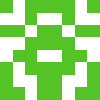
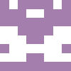
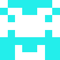
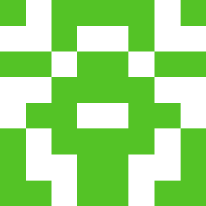
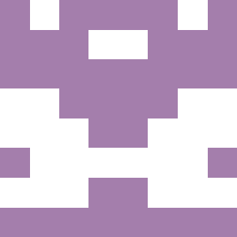

# Identicons

Python CLI to convert any string input into a unique 'identicon'.

  

Usage
```
python identicon/main.py Austin
```

Dependencies
```
pip install pillow numpy argparse
```

## Project Requirements

- Uniqueness: For any given input, the output image should be unique and not necessarily related to those of similar inputs. 
- Scale: Generate and store a 'thumbnail' and 'avatar' size, for use in different contexts as needed. It is much easier to scale down an image rather than up and keep it looking appealing, so best to go bigger.
- Appearance: Symmetry is what makes these images recognizable, so all identicons should be symmetrical. 

## Implementation

Given any input string, generate a 32-character md5 hash. In order to make the images look appealing, they should be symmetrical. With a 32-character hash, we can mirror a 4x8 grid horizontally to create a symmetrical 8x8 image. 

To do this, split the hash string into a list of 8 items, each containing 4 mirrored (so 8 total) items themselves, which represents our grid of "pixels" in the 8x8 image. For each item, if the unicode number of the character is even, this pixel will be 'off' and be set to a background color, white. If it is odd, this pixel will be 'on' and set to our foreground color. The foreground color is determined by the hexadecimal number conveniently contained in the first 6 characters of our hash code. 

Save both a scaled up 'thumbnail' and 'avatar' version of these images.

While it is theoretically possible to have duplicates for two separate inputs, there are 2<sup>32</sup> = 4,294,967,296 possible patterns, and 16<sup>6</sup> = 16,777,216 possible colors.

## Output examples

#### Avatar Scale of input 'Austin' next to thumbnail scale

 

#### Avatar Scale of input 'Bailey' next to thumbnail scale

 

## Potential improvements

- While unlikely, it is possible to have an image whose foreground color is nearly white, and indistinguishable from the background. In this case, we could set a 'max' hexidecimal number that would be dark enough to be distinguishable.
- Also highly unlikely, it is possible to have an image that is entirely or almost entirely background or foreground pixels, making for an output that is not appealing. In this case, we could throttle the number of 'on' or 'off' pixels, and flip some as needed. 
- Could give the identicons more variation with other colors featured.
- Customize background and foreground color.